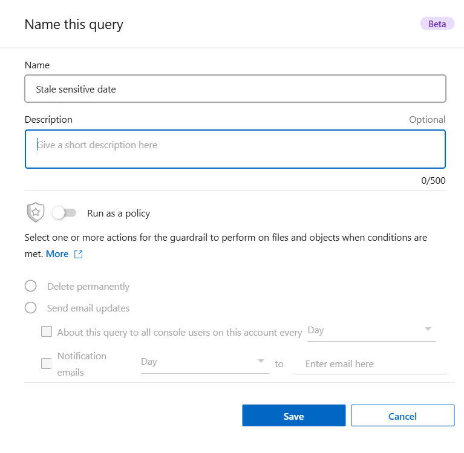

= 
:allow-uri-read: 

.步骤
. 在调查选项卡中，通过选择要使用的过滤器来定义搜索。看link:task-investigate-data.html["在调查页面中过滤数据"]了解详情。
. 一旦您根据自己的喜好设置了所有过滤器特性，请选择*保存查询*。
+
image:../media/screenshot_compliance_save_as_highlight.png["屏幕截图显示了如何将过滤后的查询保存为已保存的查询。"]

. 为保存的查询命名并添加描述。该名称必须是唯一的。
. 您可以选择将查询保存为策略：
+
.. 要将查询保存为策略，请切换*作为策略运行*开关。
.. 选择*永久删除*或*发送电子邮件更新*。如果您选择电子邮件更新，您可以每天、每周或每月通过电子邮件将查询结果发送给所有控制台用户。或者，您可以以相同的频率将通知发送到特定的电子邮件地址。

. 选择*保存*。
+

创建搜索或策略后，您可以在**已保存的查询**选项卡中查看它。
